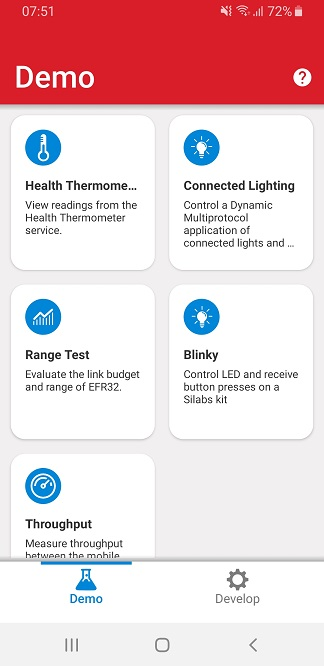
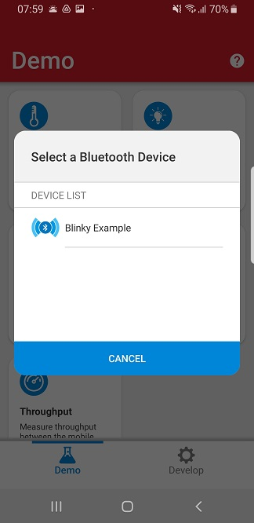
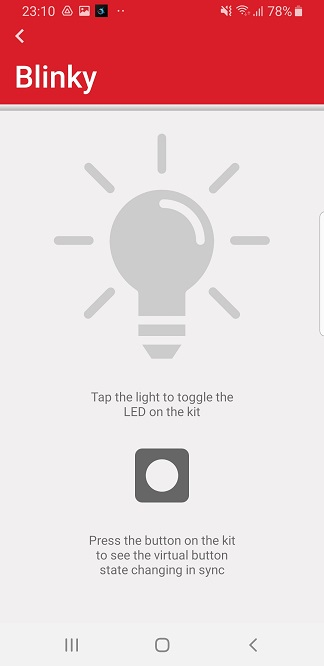
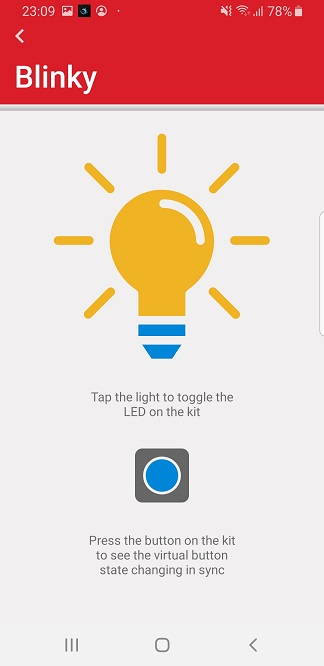
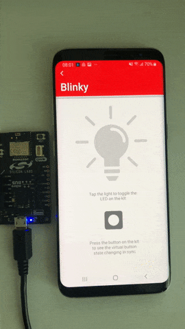

# CircuitPython - Bluetooth - SoC - Blinky #

## Overview ##

This example application is the "Hello World" of Bluetooth Low Energy (BLE). It allows a BLE central device to control the LED on the mainboard and receive button press notifications.

## Hardware Required ##

- [EFR32xG24 Dev Kit](https://www.silabs.com/development-tools/wireless/efr32xg24-dev-kit?tab=overview)

## Connections Required ##

Power the EFR32xG24 Dev Kit with a micro-usb cable connected to a usb port on a laptop or an USB Charger

## Prerequisites ##

Getting started with [CircuitPython on EFR32 boards](../doc/running_circuitpython.md).

## Setup ##

To run the example you need to install **[Thonny](https://thonny.org/)** editor and then follow the steps below:

1. Flash the corresponding CircuitPython binary for your board. You can visit [circuitpython.org/downloads](https://circuitpython.org/downloads?q=silabs) to download the binary.

> **_NOTE:_** The examples in this repository require CircuitPython v8.2.0 or higher.

2. Upload all the files and folders from the device_root folder to the CircuitPython device. The files and folders should be copied into the root of the file system on the target device.

3. Run the scripts on the board.

## How it Works ##

### Getting started ###

This example implements a simple custom GATT service with two characteristics. One characteristic controls the state of the LED (ON/OFF) via write operations from a GATT client, and the second characteristic sends notifications to subscribed clients when the button state changes (pressed or released).

To test this demo, install EFR Connect for [Android](https://play.google.com/store/apps/details?id=com.siliconlabs.bledemo&hl=en&gl=US) or [iOS](https://apps.apple.com/us/app/efr-connect/id1030932759). Source code for the mobile app is available on [Github](https://github.com/SiliconLabs?q=efrconnect&type=&language=&sort=).

After launching the app go to the demo view and select the Blinky demo. A pop-up will show all the devices around you that are running the SoC-Blinky firmware. Tap on the device to go into the demo view.

 

Tap the light on the mobile app to toggle the LED on the mainboard. When you press/release the button on the mainboard the state changes for the virtual button on the app as well.

 

### GATT database ###

- [Service] Blinky Example
  - [Char] LED Control - led_control
    - [R] Get LED status
    - [W] Set LED on/off
  - [Char] Report Button - report_button
    - [R, N] Get button status

## Output ##

The animation below showcases the demo running on a EFR32xG24 Dev Kit (BRD2601B) with the mobile app running on an Android device.

