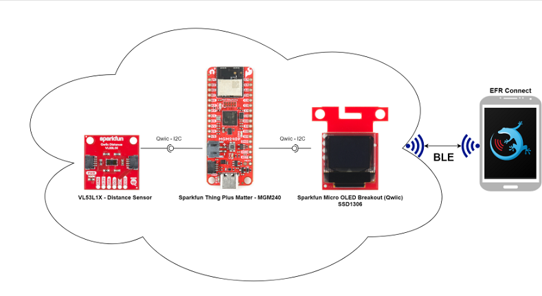

# CircuitPython - Bluetooth - Distance Monitor (VL53L1X) #

## Overview ##

This project shows a demonstration of a Bluetooth Low Energy distance monitor system using SparkFun Thing Plus Matter - MGM240P development kit and the integrated CircuitPython BLE Stack.

The block diagram of this application is shown in the image below:

## Hardware Required ##

- [SparkFun Thing Plus Matter - MGM240P](https://www.sparkfun.com/products/20270)

- [SparkFun Distance Sensor Breakout - 4 Meter, VL53L1X (Qwiic)](https://www.sparkfun.com/products/14722)

- [OLED Display - SSD1306](https://www.sparkfun.com/products/14532)

## Connections Required ##

The sensor and OLED display can easily connected with Sparkfun Thing Plus for Matter - MGM240 development kits via Qwiic connector.

## Prerequisites ##

Getting started with [CircuitPython on EFR32 boards](../doc/running_circuitpython.md).

## Setup ##

To run the example you need to install **Thonny** editor and then follow the steps below:

1. Flash the corresponding CircuitPython binary for your board. You can visit [circuitpython.org/downloads](https://circuitpython.org/downloads?q=silabs) to download the binary.

> **_NOTE:_** The examples in this repository require CircuitPython v8.2.0 or higher.

2. Install the necessary libraries from Adafruit CircuitPython bundle. You can download the bundle from [here](https://circuitpython.org/libraries). The libraries that used in this project and their version are list in this table below.

    | Library           | Version           |
    |:----------------- |:------------------|
    | adafruit_framebuf |       1.6.1       |
    | adafruit_ssd1306  |       2.12.2      |
    | adafruit_vl53l1x  |       1.1.10      |

3. Upload all the libraries of the lib folder to the CircuitPython device. The binary files should not be uploaded to lib folder in the device, they should have the same hierarchy as the code.py file.

4. Copy the content of the code.py and paste it to the code.py file on the CircuitPython device.

5. Run the scripts on the board.

## How it Works ##

- ### Initialization ###

    .

- ### Runtime operation ###

    .

- ### GATT database ###

  - [Service] Distance Monitor
    - [Char] Lower Threshold Value - threshold_value_lower
      - [R] Get lower threshold value (mm)
      - [W] Set lower threshold value (mm)
    - [Char] Upper Threshold Value - threshold_value_upper
      - [R] Get upper threshold value (mm)
      - [W] Set upper threshold value (mm)
    - [Char] Threshold Mode - threshold_mode
      - [R] Get threshold mode (0-2)
      - [W] Set threshold mode (0-2)
    - [Char] Range Mode - range_mode
      - [R] Get configured range mode (0-1)
      - [W] Set range mode (0-1)
    - [Char] Notification Status - notification_status
      - [R] Get configured notification status (0-2)
      - [W] Set notification status (0-2)

## Output  ##

Run the **code.py** file, monitor the OLED, and try to place your hand beyond the sensor you will see the result below.

