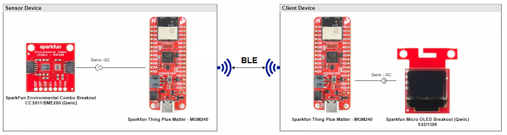
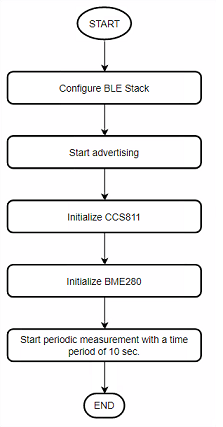
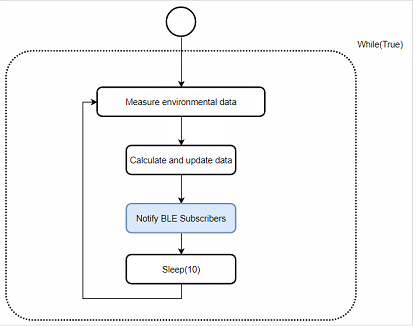
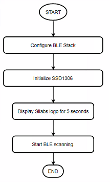
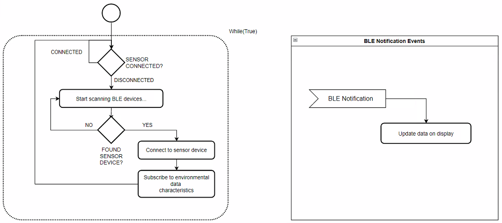

# CircuitPython - Bluetooth - Environmental Sensing (CCS811/BME280) #

## Overview ##

This project aims to implement an environmental sensing system using Sparkfun Thing Plus for Matter - MGM240 development kits and external sensors integrated with the BLE wireless stack and CircuitPython.

The block diagram of this application is shown in the image below:

The wireless environment sensing system is composed of a sensor and minimum one client device. The sensor device continuously monitors the ambient temperature, humidity and the air quality. The sensor continuously sends the measured data to the client device.

### Sensor Device ###

At first, the sensor device broadcasts its advertisement package that includes its name (CP_ENV_SENSOR) and the UUID of the **Environmental Sensing Service (0x181A)**. A client device can scan and connect to the sensor device; the sensor device can periodically notify the client.

### Client Device ###

The client device scans periodically the BLE network. Once it found the sender device, it tries to connect to it and reads all the characteristics in the **Environmental Sensing Service (0x181A)**, then it is visible on the OLED display.

Note: Any other BLE-capable device can be a client device, for instance a simple cell phone.

## Hardware Required ##

### Sensor ###

- [SparkFun Thing Plus Matter - MGM240P](https://www.sparkfun.com/products/20270)
- [SparkFun Environmental Combo Breakout - CCS811/BME280 (Qwiic)](https://www.sparkfun.com/products/14348)

### Client ###

- [SparkFun Thing Plus Matter - MGM240P](https://www.sparkfun.com/products/20270)
- [OLED Display - SSD1306](https://www.sparkfun.com/products/14532)

## Connections Required ##

The environmental combo, OLED display and SparkFun Thing Plus Matter board can easily connect to each other via Qwiic I2C connector.

## Setup ##

To run the example you need to install **Thonny** editor and then follow the steps below:

1. Flash the corresponding CircuitPython binary for your board. You can visit [circuitpython.org](https://circuitpython.org/) to download the binary.

2. Install the necessary libraries from Adafruit CircuitPython bundle. You can download the bundle from [here](https://circuitpython.org/libraries). The libraries that used in this project and their version are list in this table below.
    - Sensor device

      | Library           | Version           |
      |:----------------- |:------------------|
      | adafruit_register |       1.9.15      |
      | adafruit_bme280   |       2.6.20      |
      | adafruit_ccs811   |       1.3.13      |

    - Client device 

      | Library           | Version           |
      |:----------------- |:------------------|
      | adafruit_framebuf |       1.6.1       |
      | adafruit_ssd1306  |       2.12.12     |

3. Upload all the libraries and files of the lib folder to the CircuitPython device. The files in binary folder should not be uploaded to lib folder in the device, they should have the same hierarchy as the **code.py** file.

4. Copy the content of the **code.py** and paste it to the **code.py** file on the CircuitPython device.

    - Sensor device: [code.py](application/sensor/code.py)

    - Client device: [code.py](application/client/code.py)

5. Run the scripts on the board.

## How it Works ##

### Sensor ###

- **Initialization process**

    

- **GATT Database:**
  - [Service] Environmental Sensing
    - [Char] Temperature
      - [R, N] Get temperature value (e.g.: 25.5  C => 255)
    - [Char] Humidity
      - [R, N] Get humidity value (e.g.: 25.5 % => 255)
    - [Char] TVOC
      - [R, N] Get TVOC value in ppm
    - [Char] CO2
      - [R, N] Get CO2 value in ppm

- **Runtime operation**

    

### Client ###

- **Initialization process**

    

- **Runtime operation**

    

## Output ##

Run the **code.py** file on both sensor and client device and monitor the OLED you will see the result like below.

  
