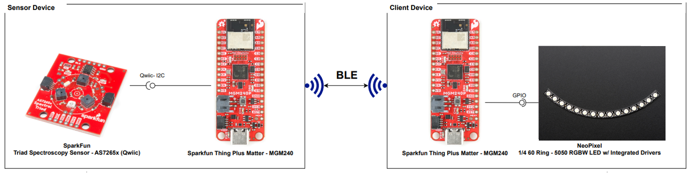

# CircuitPython - Bluetooth - Light Detector (AS7265x) #

## Overview ##

This project aims to implement a wireless light detector system using Sparkfun Thing Plus for Matter - MGM240 development kits and external sensors integrated with the BLE wireless stack and CircuitPython.

The overview of this application is shown in the image below:

The wireless light detector system is composed of a sensor and a client device: 

**Sensor Device**

The sensor device is a Sparkfun Thing Plus Matter - MGM240P kit connected to a SparkFun Triad Spectroscopy Sensor - AS7265x (Qwiic) board.

The sensor device will measure the intensity of 6 colors in the spectral range: red, orange, yellow, green, blue, and violet. This device implements a GATT Server and provides the measured values via BLE Characteristics. The client device can connect to the sensor and gather the provided environmental data by reading the BLE Characteristics.

**Client Device**

The client device is a Sparkfun Thing Plus Matter - MGM240P kit connected to a NeoPixel 1/4 60 Ring - 5050 RGBW LED w/ Integrated Drivers display. 

The client device connects to the sensor device via BLE and reads the provided light data via BLE characteristics. The gathered light data is displayed on the connected 1/4 NeoPixel Ring.

## Hardware Required ##

### Sensor ###

- [SparkFun Thing Plus Matter - MGM240P](https://www.sparkfun.com/products/20270)
- [SparkFun Triad Spectroscopy Sensor - AS7265x (Qwiic)](https://www.sparkfun.com/products/15050)

### Client ###

- [SparkFun Thing Plus Matter - MGM240P](https://www.sparkfun.com/products/20270)
- [NeoPixel 1/4 60 Ring - 5050 RGBW LED w/ Integrated Drivers - Natural White](https://www.adafruit.com/product/2874)

## Connections Required ##

The Spectroscopy Sensor and SparkFun Thing Plus Matter board can easily connect via a Qwiic I2C connector.

The NeoPixel and SparkFun Thing Plus Matter board can connect via SPI. Connect the DIN pin on NeoPixel to a GPIO pin on the SparkFun Thing Plus Matter board that is configured as a MOSI pin.

## Prerequisites ##

Getting started with [CircuitPython on EFR32 boards](../doc/running_circuitpython.md).

## Setup ##

To run the example you need to install **Thonny** editor and then follow the steps below:

1. Flash the corresponding CircuitPython binary for your board. You can visit [circuitpython.org/downloads](https://circuitpython.org/downloads?q=silabs) to download the binary.

> **_NOTE:_** The examples in this repository require CircuitPython v8.2.0 or higher.

2. Install the necessary libraries from Adafruit CircuitPython bundle. You can download the bundle from [here](https://circuitpython.org/libraries). The libraries that are used in this project and their version are listed in the table below.
    - Sensor device

      | Library           | Version           |
      |:----------------- |:------------------|
      | adafruit_as726x   |       1.9.15      |

    - Client device 

      | Library           | Version           |
      |:----------------- |:------------------|
      | neopixel_spi      |       1.6.1       |

3. Upload all the libraries and files of the lib folder to the CircuitPython device. The files in the binary folder should not be uploaded to the lib folder in the device, they should have the same hierarchy as the **code.py** file.

4. Copy the content of the **code.py** and paste it to the **code.py** file on the CircuitPython device.

    - Sensor device: [code.py](sensor/src/code.py)

    - Client device: [code.py](client/src/code.py)

5. Run the scripts on boards.

## How it Works ##

### Sensor ###

- **Initialization process**

    

- **GATT Database:**
    - [Service] Light Sensing
        - [Char] Color R
            - [R, N] Get red color value
        - [Char] Color O
            - [R, N] Get orange color value
        - [Char] Color Y
            - [R, N] Get yellow color value
        - [Char] Color G
            - [R, N] Get green color value
        - [Char] Color B
            - [R, N] Get blue color value
        - [Char] Color V
            - [R, N] Get violet color value

- **Runtime operation**: The sensor device periodically measures the environmental data every 2 seconds.

    

- **BLE**
    - Read characteristics

### Client ###

- **Initialization process**

    

- **Runtime operation**

    

## Output Display ##

The Neopixel ring changes colors based on the change of light measured by the Spectroscopy sensor. The ring is equipped with 15 LEDs, organized into six groups, with each group corresponding to a specific light sensing channel on the sensor. The first two LEDs are red, followed by two orange LEDs, then two yellow LEDs. The subsequent three LEDs are green, another three are blue, and the last three are violet.

The brightness of each LEDs group is determined by the intensity of the corresponding color channel on the sensor. The more intense the value on a specific channel, the more intense the brightness with the corresponding color on the ring.

Run the **code.py** file on both sensor and client device and monitor the NeoPixel you will see the result below.

Sensor Shell

From the log and picture, you can see that value of the violet channel is the highest so the brightness of the violet LEDs group is also the highest, the red channel has the lowest value so the red LEDs group also has the lowest brightness, similar to other channels.