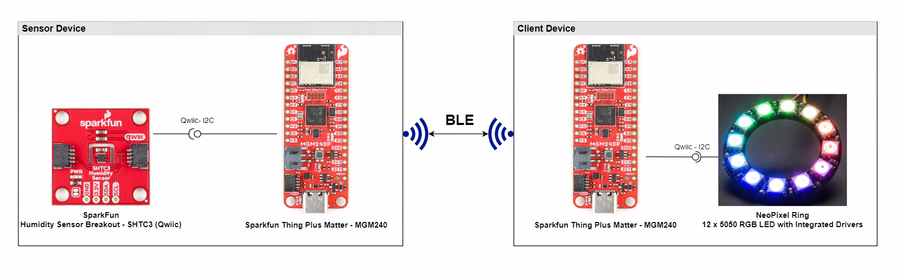
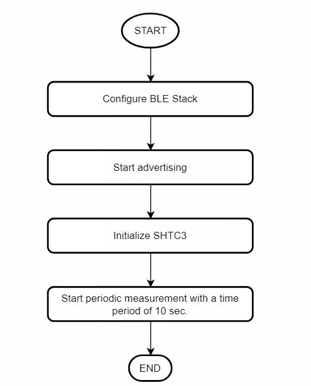
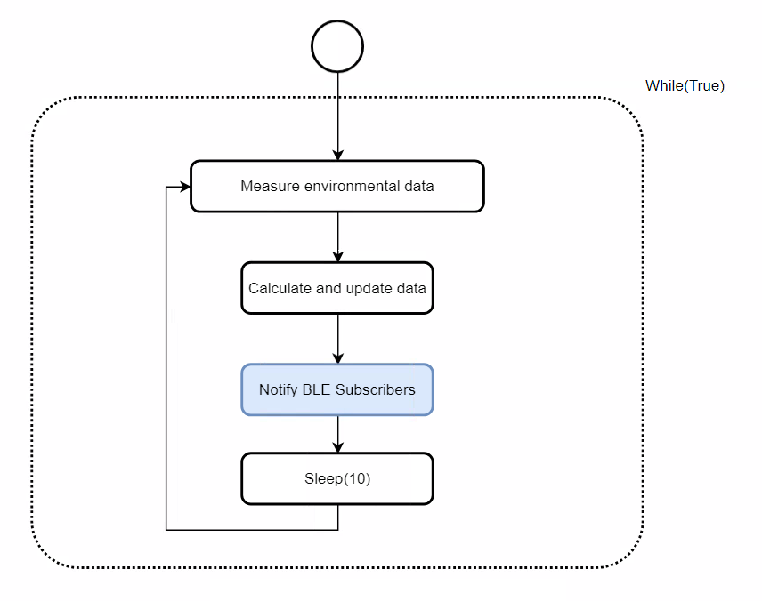
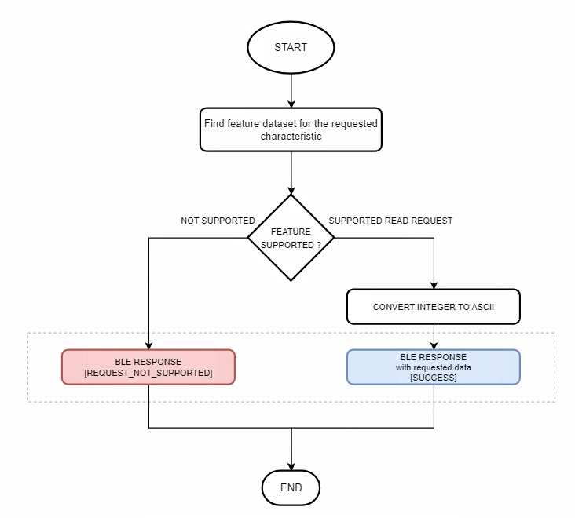
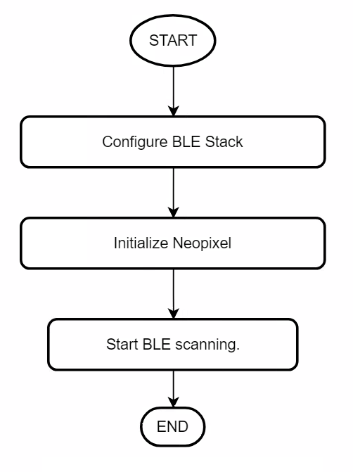
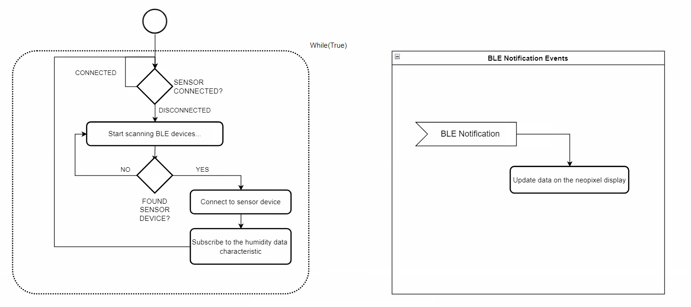
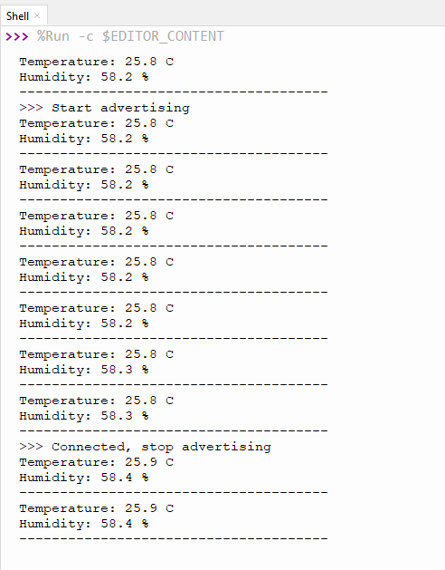
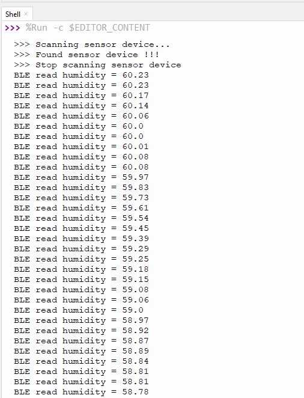

# CircuitPython - Bluetooth - Neopixel humidity gauge (SHTC3) #

## Overview ##

This project aims to implement a wireless humidity gauge sensing system using Sparkfun Thing Plus for Matter - MGM240 development kits and external sensors integrated with the BLE wireless stack and CircuitPython.
The block diagram of this application is shown in the image below:

  

### Sensor Device ###

The sensor device is a Sparkfun Thing Plus Matter - MGM240P kit connected to a SparkFun Humidity Sensor Breakout - SHTC3 (Qwiic) board. This device periodically provides the humidity level.

The sensor device implements a GATT Server and provides the measured values via BLE Characteristics. The client device can connect to the sensor and gather the provided environmental data by reading the BLE Characteristics.

### Client Device ###

The client device is a Sparkfun Thing Plus Matter - MGM240P kit connected to a NeoPixel Ring - 12 x 5050 RGB LED with Integrated Drivers display.  The client device connects to the sensor device via BLE and reads the provided environmental data via BLE characteristics.

The gathered humidity data is displayed on the connected NeoPixel Ring.

## Hardware Required ##

### Silabs Development Kits ###

- [SparkFun Thing Plus Matter - MGM240P](https://www.sparkfun.com/products/20270)

### External Hardware ###

- [SparkFun Humidity Sensor Breakout - SHTC3 (Qwiic)](https://www.sparkfun.com/products/16467)
- [NeoPixel Ring - 12 x 5050 RGB LED with Integrated Drivers](https://www.adafruit.com/product/1643)

### Prerequisites ###

- Getting started with [CircuitPython on EFR32 boards](../doc/running_circuitpython.md).

## Setup ##

To run the example you need to install **Thonny** editor and then follow the steps below:

1. Flash the corresponding CircuitPython binary for your board. You can visit [circuitpython.org/downloads](https://circuitpython.org/downloads?q=silabs) to download the binary.

    >**_NOTE:_** The examples in this repository require CircuitPython v8.2.0 or higher.

2. Install the necessary libraries from Adafruit CircuitPython bundle. You can download the bundle from [here](https://circuitpython.org/libraries). The libraries that used in this project and their version are list in this table below.
    - Sensor device

      | Library           | Version           |
      |:----------------- |:------------------|
      | adafruit_shtc3    |       1.9.15      |

    - Client device

      | Library           | Version           |
      |:----------------- |:------------------|
      | neopixel_spi      |       1.6.1       |

3. Upload all the libraries and files of the lib folder to the CircuitPython device. The files in binary folder should not be uploaded to lib folder in the device, they should have the same hierarchy as the **code.py** file.

4. Copy the content of the **code.py** and paste it to the **code.py** file on the CircuitPython device.

    - Sensor device: [code.py](sensor/src/code.py)

    - Client device: [code.py](client/src/code.py)

5. Run the scripts on the board.

## How it Works ##

### Sensor ###

- **Initialization process**  
  

- **Runtime**
  The sensor device periodically measures the environmental data with a time period of 10 seconds.
  

- **BLE**

  ***Read Characteristics***
  

- **GATT Database:**
  - Device name: "CP_HUM_SENSOR"
    - [Service] Humidity Sensing
      - [Char] Humidity
        [R, N] Get humidity value (e.g.: 25.5 % => 255)

### Client ###

- **Initialization process**  
  

- **Runtime operation**  
  

### Output Display ###

Measured values should be displayed on the connected Neopixel Ring display.
After startup, if client app is scanning sensor app via BLE, Neopixel will blink. After the connection is established, the client app will receive the humidity data and display it via Neopixel. The Neopixel ring has 12 RGB LEDs. The measured humidity value is in the 0-100% range and 8% => 1 LED.

The NeoPixel ring is made up of 12 individual RGB LEDs, which means that each LED can display any color in the RGB color space. In this example, the colors displayed are based on the humidity level measured by the SHTC3 sensor.

The SHTC3 sensor measures relative humidity as a percentage. In this example, the range of humidity values is divided into 12 equal parts, with each part corresponding to one LED on the NeoPixel ring. When the humidity is at 0%, only the first LED lights up with a blue color, which indicates a low humidity level. As the humidity level increases, more LEDs light up on the ring, and the colors become warmer.

For example, if the humidity level is at 10%, then the first two LEDs light up with a warmer color than blue. At 20% humidity, the first three LEDs light up with a warmer color, and so on. At 100% humidity, all 12 LEDs light up with the warmest color, indicating that the humidity level is very high.

Run the **code.py** file on both sensor and client device and monitor the NeoPixel you will see the result like below.

**Sensor Shell**  
  

**Client Shell**  
  

**Hardware**
  
