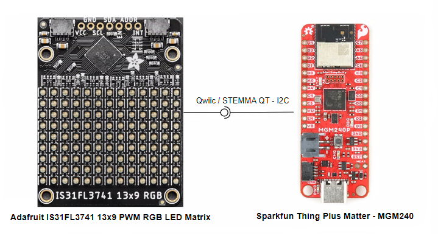
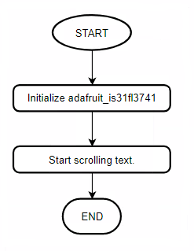

# CircuitPython - Non-Wireless Display Demo (IS31FL3741) #

## Overview ##

This application code demonstrates the integration of CircuitPython into Silicon Labs Development Kits. It also provides support how to use of an Adafruit IS31FL3741 LED display with Silicon Labs Development Kits. The example showcases how to program the Silabs devkits using CircuitPython and how to display text on Adafruit LED Displays. In this example, you can see how a text displayed on the LED Display: **"Silabs now supports CircuitPython!!!"**.

This example can be used as a learning tool for developers who want to work with CircuitPython and Silabs Development Kits. Additionally, it showcases the capabilities of Silabs Development Kits and how they can be used to create IoT devices and applications.

## Hardware Required ##

- [SparkFun Thing Plus Matter - MGM240P](https://www.sparkfun.com/products/20270)

- [Adafruit 13x9 PWM RGB LED Matrix Driver - IS31FL3741](https://www.adafruit.com/product/5201)

## Connections Required ##

The RGB LED Matrix can easily connected with Sparkfun Thing Plus for Matter - MGM240 development kits via Qwiic connector.

## Prerequisites ##

Getting started with [CircuitPython on EFR32 boards](../doc/running_circuitpython.md).

## Setup ##

To run the example you need to install **Thonny** editor and then follow the steps below:

1. Flash the corresponding CircuitPython binary for your board. You can visit [circuitpython.org/downloads](https://circuitpython.org/downloads?q=silabs) to download the binary.

> **_NOTE:_** The examples in this repository require CircuitPython v8.2.0 or higher.

2. The lib folder on github contains the necessary library files. You can get updates from the bundle [here](https://circuitpython.org/libraries). The libraries used in this project are listed below.

    | Library           | Version           |
    |:----------------- |:------------------|
    | adafruit_framebuf |       1.6.1       |
    | adafruit_is31fl3741 |       1.4.1      |

3. Upload all the files and folders from the device_root folder to the CircuitPython device. The files and folders should be copied into the root of the file system on the target device.

4. Run the scripts on the board.

## How it Works ##

- ### Initialization ###

    .

- ### Runtime operation ###

    In this project, the following text shall be displayed scrolling : **Silabs now supports CircuitPython!!!**

## Output ##

Run the **code.py** file, you will see the result below.

