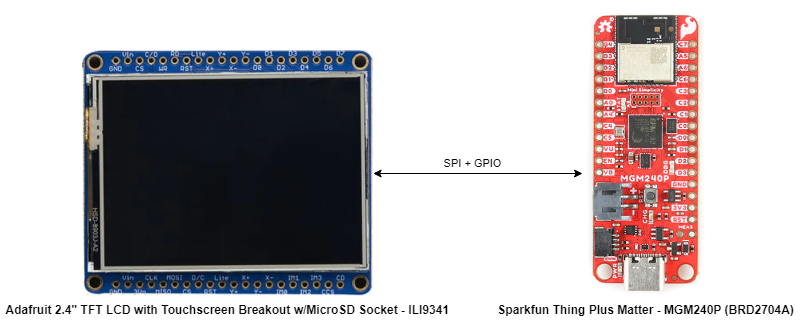
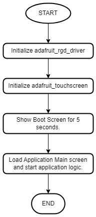
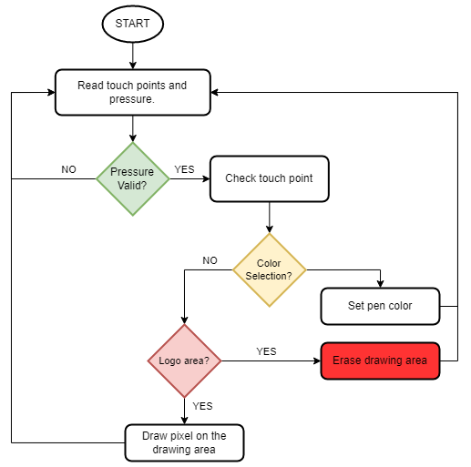

# CircuitPython - RGB Display Drawing (ILI9341) #

## Summary ##

This example application code demonstrates how to use CircuitPython and the adafruit_rgb_display and adafruit_touchscreen drivers on Silabs development kits, such as "Sparkfun ThingPlus Matter board," the "xG24 explorer kit," and the "xG24 devkit."

The demo shows how to draw on a 2.4" TFT LCD with Touchscreen Breakout w/MicroSD Socket - ILI9341 using Silabs development kits.

## Hardware Required ##

- [SparkFun Thing Plus Matter - MGM240P](https://www.sparkfun.com/products/20270)

- [Adafruit 2.4" TFT LCD with Touchscreen Breakout w/MicroSD Socket - ILI9341](https://www.adafruit.com/product/2478)

## Connections Required ##

The TFT LCD can easily connected with Sparkfun Thing Plus for Matter - MGM240 development kits via jumper wire like this picture.

The following picture shows how the system works.

Listed below are the port and pin mappings for working with this example.

- Board: **BRD2704A - Sparkfun Thing Plus Matter - MGM240P**

    | Pin | Connection | Pin function |
    |:---:|:-------------:|:---------------|
    | PC0 | D/C | GPIO |
    | PC1 | CS | SPI CS |
    | PC2 | CLK | SPI SCK |
    | PC3 | MISO | SPI MISO |
    | PC6 | MOSI | SPI MOSI |
    | PA0 | XP(X+) | AN |
    | PA4 | YP(Y+) | AN |
    | PB0 | YM(Y-) | AN |
    | PB1 | XM(Y+) | AN |

## Prerequisites ##

Getting started with [CircuitPython on EFR32 boards](../doc/running_circuitpython.md).

## Setup ##

To run the example you need to install **[Thonny](https://thonny.org/)** editor and then follow the steps below:

1. Flash the corresponding CircuitPython binary for your board. You can visit [circuitpython.org/downloads](https://circuitpython.org/downloads?q=silabs) to download the binary.

> **_NOTE:_** The examples in this repository require CircuitPython v8.2.0 or higher.

2. The lib folder on github contains the necessary library files. You can get updates from the bundle [here](https://circuitpython.org/libraries). The libraries used in this project are listed below.

    | Library           | Version           |
    |:----------------- |:------------------|
    | adafruit_imageload |       1.17.1       |
    | adafruit_ili9341  |       1.3.8      |
    | adafruit_touchscreen |       1.2.1      |

3. Upload all the files and folders from the device_root folder to the CircuitPython device. The files and folders should be copied into the root of the file system on the target device.

4. Run the scripts on the board.

## How it Works ##

- ### Initialization ###

    .

- ### Runtime operation ###

    .

## Testing ##

Run the **code.py** file.
- After start, you can see the logo of Silicon Labs and CircuitPython for 5 second.  
- Then it show the logo and color selector at the bottom side of the screen.
- You can start to draw or pick color by tab the color you want in color pallete and the present pen color will show in small rectangle at the top left of screen.
- Or you can clear all the screen by tab the Silabs logo. 

