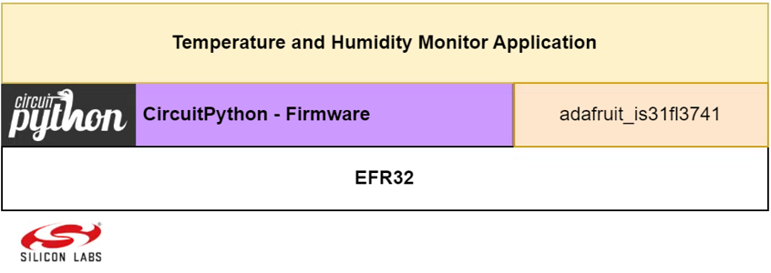

# CircuitPython - Temperature and Humidity Monitor with LED Matrix Display (SI2071/IS31FL3741) #

## Overview ##

This example code demonstrates the use of the CircuitPython IS31FL3741 RGB Display driver with the Silabs xG24 devkit. The code reads temperature and humidity data from the SI2071 RHT sensor and displays the data on the IS31FL3741 RGB display. The code serves as a starting point for developers who want to build their projects using the driver and the xG24 devkit to display temperature and humidity values.

The block diagram of this application is shown in the image below:

## Hardware Required ##

- [Adafruit IS31FL3741 13x9 PWM RGB LED Matrix Driver - STEMMA QT / Qwiic](https://www.adafruit.com/product/5201)

- [EFR32xG24 Dev Kit](https://www.silabs.com/development-tools/wireless/efr32xg24-dev-kit?tab=overview)

## Connections Required ##

The RGB LED Matrix display can easily connect with Silicon Labs
EFR32xG24 Dev Kit via a Qwiic connector.

## Prerequisites ##

Getting started with [CircuitPython on EFR32 boards](../doc/running_circuitpython.md).

## Setup ##

To run the example you need to install **Thonny** editor and then follow the steps below:

1. Flash the corresponding CircuitPython binary for your board. You can visit [circuitpython.org/downloads](https://circuitpython.org/downloads?q=silabs) to download the binary.

> **_NOTE:_** The examples in this repository require CircuitPython v8.2.0 or higher.

2. Install the necessary libraries from the Adafruit CircuitPython bundle. You can download the bundle from [here](https://circuitpython.org/libraries). The libraries that were used in this project and their version are listed in the table below.

    | Library           | Version           |
    |:----------------- |:------------------|
    | adafruit_is31fl3741 |       1.6.1       |
    | adafruit_si7021  |       2.12.2      |

    
3. Upload all the libraries and files of the lib folder to the CircuitPython device. The binary files should not be uploaded to the "lib" folder in the device, they should have the same hierarchy as the code.py file.

4. Copy the content of the code.py and paste it to the code.py file on the CircuitPython device.

5. Run the scripts on the board.

## How it Works ##

- ### Initialization ###

    

- ### Runtime operation ###

    

- ### Read data from the sensor callback ###

    

- ### Display scroll callback ###

    .

## Output ##

Run the **code.py** file, and monitor the LED Matrix. You will see that the temperature and humidity parameters will be read from the sensor with a period of 1s. And these values ​​are displayed on LED Matrix and the text will run from right to left of the screen.

