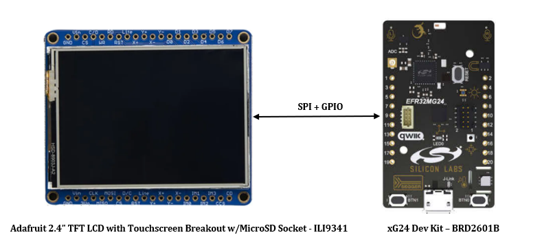
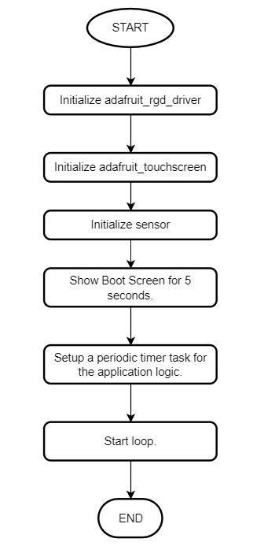
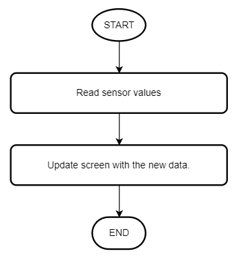

# CircuitPython - xG24 Dev Kit Sensors (ILI9341) #

## Summary ##

This project demonstrates how to use the Silicon Labs xG24 Dev Kit with CircuitPython language.

The sensor data is read from the built-in sensors of the Silicon Labs xG24 Dev Kit, including the SI2071 RHT, ICM-20689 accelerometer, and BMP384 barometer, then the data is displayed on the ILI9341 RGB screen using the ILI9341 RGB Display driver.

The block diagram of this application is shown in the image below:

## Hardware Required ##

- [EFR32xG24 Dev Kit - BRD2601B](https://www.silabs.com/development-tools/wireless/efr32xg24-dev-kit?tab=overview)

- [Adafruit 2.4" TFT LCD with Touchscreen Breakout w/MicroSD Socket - ILI9341](https://www.adafruit.com/product/1770)

## Connection Required ##

The xG24 Dev Kit and TFT display can connect via SPI interface. You can make the connection according to the table below:

| xG24 Dev Kit | TFT LCD display | 
|:-------|:------:|
|  2 (VMCU)  |  Vin  |
|  1 (GND)  |  GND  |
|  8 (SCLK)  |  CLK  |
| 6 (CIPO)  |  MISO  |
|  4 (COPI)  |  MOSI  |
|  9 (PB0)  |  CS  |
|  3 (PB2)  |  D/C  |

## Prerequisites ##

Getting started with [CircuitPython on EFR32 boards](../doc/running_circuitpython.md).

## Setup ##

To run the example you need to install Thonny editor, then follow the below steps:

1. Install the necessary libraries from Adafruit CircuitPython bundle. You can download the bundle from [here](https://github.com/adafruit/Adafruit_CircuitPython_Bundle). To upload the libraries to CircuitPython device.

2. Upload all the files in **lib** folder into CircuitPython device.

3. Copy the content of the code.py file into the src folder and paste it to the code.py file on the CircuitPython device.

4. Run the scripts on the board.

**Note:**

- Make sure that you have flashed the corresponding CircuitPython firmware for your board. You can visit [circuitpython.org](https://circuitpython.org/board/silabs_devkit_xg24_brd2601b/) to download the firmware.

> **_NOTE:_** The examples in this repository require CircuitPython v8.2.0 or higher.

## How it works ##

This project demonstrates the use of the CircuitPython IL9341 RGB Display driver with the Silicon Labs xG24 Dev Kit.

For the beginning, the screen will show the Silicon Labs logo and CircuitPython logo for 5 seconds.

After that, the parameters of built-in sensors on xG24 Dev Kit will show on the screen.

**Application Initialization**

**Application Logic**

## Output ##

After you powered the devices, the boot screen is visible for 5 seconds. Then the parameters of built-in sensors on xG24 Dev Kit are visible on the application screen every 3 seconds.

You can run the code.py file or press the Reset button. On the display, you will see the result below:

