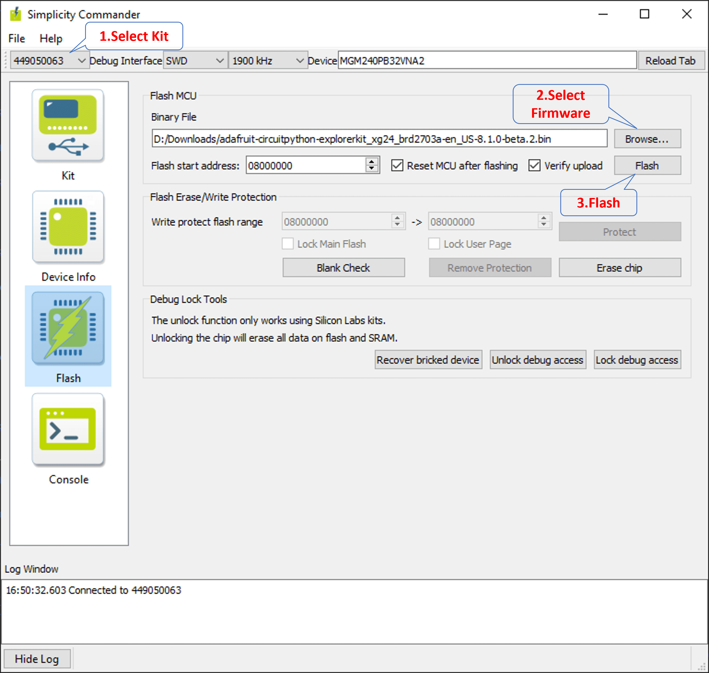
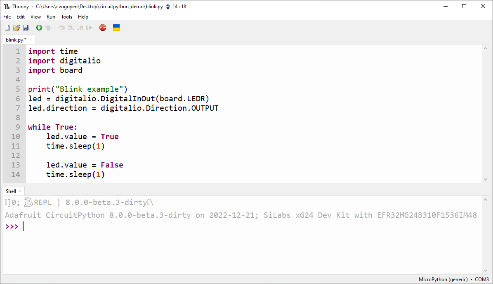
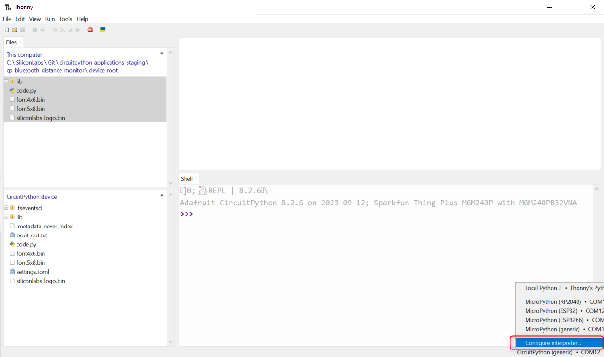
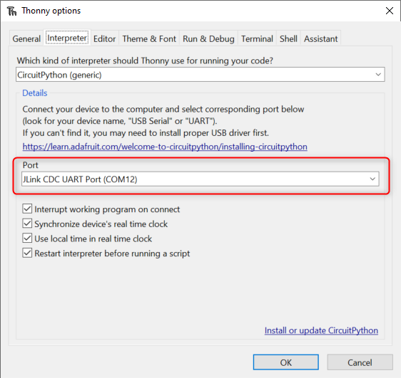
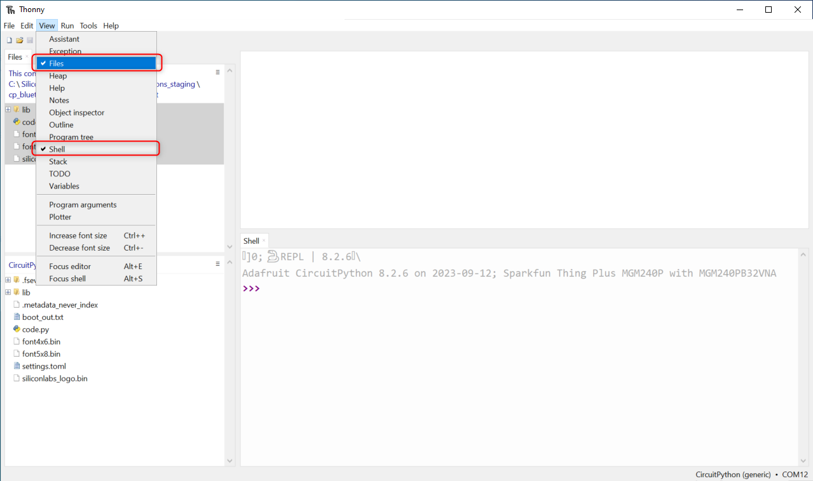
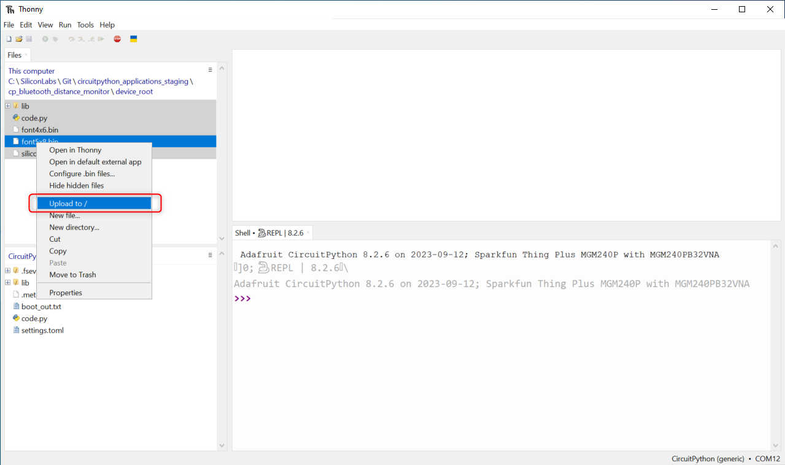
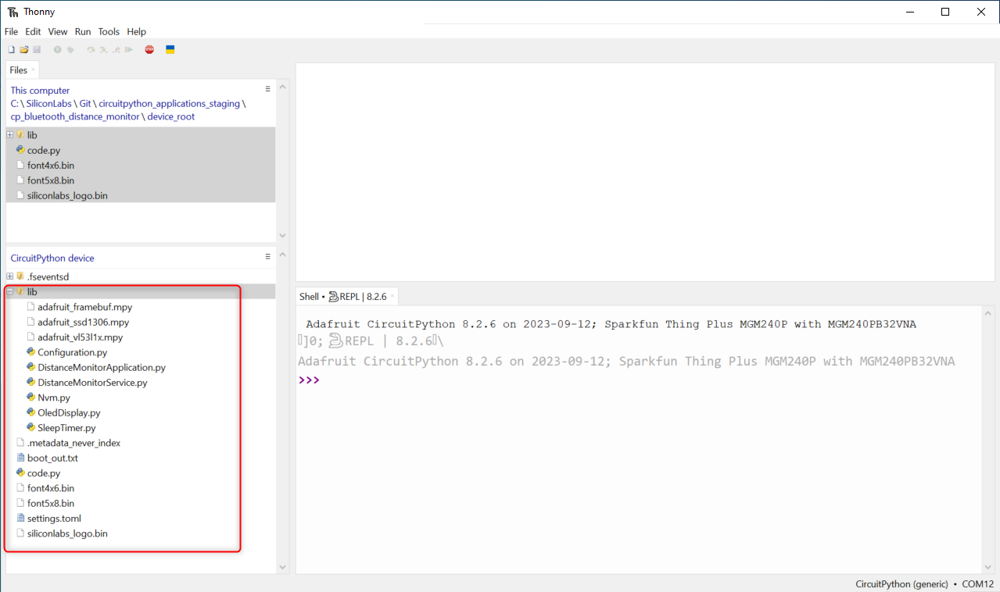
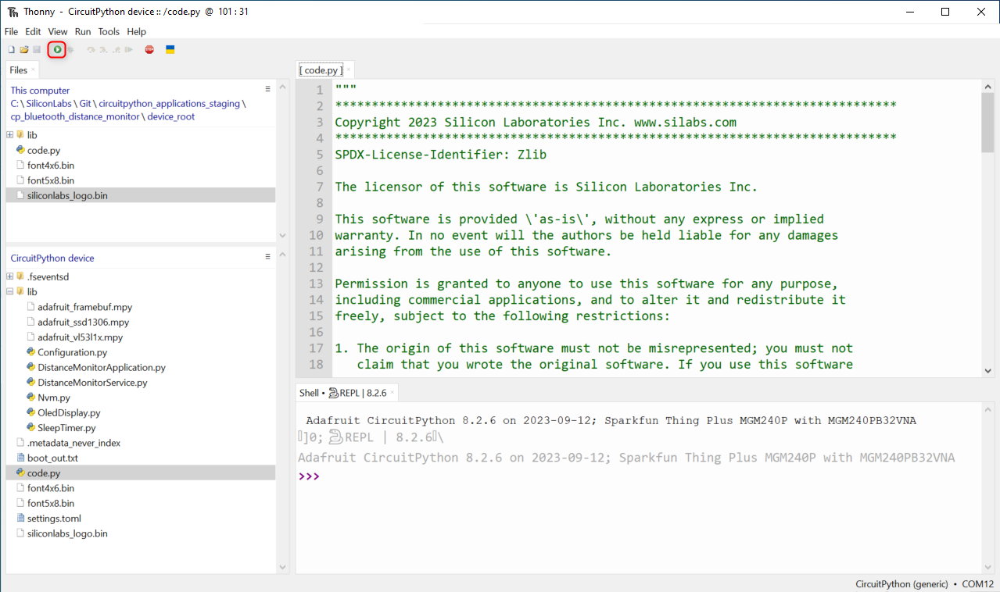
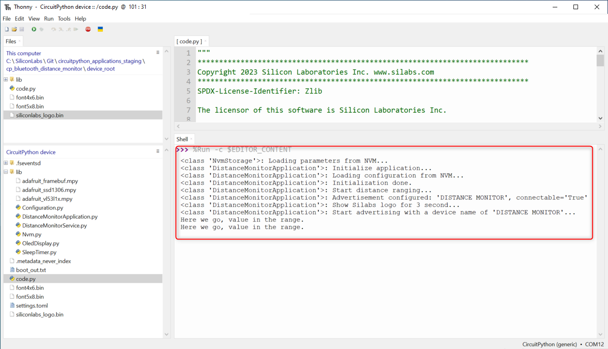

# Running Circuitpython
## Dowload CircuitPython Firmware 

Official binaries for all supported boards are available through [circuitpython.org/downloads](https://circuitpython.org/downloads?q=silabs). The site includes stable,unstable and continuous builds.

If you want to make changes, you might clone and re-build the source and firmware.bin file can be found in the build folder corresponding to the appropriate board, such as build-sparkfun_thingplus_matter_mgm240p_brd2704a

> **_NOTE:_** The examples in this repository require CircuitPython v8.2.0 or higher.

## Flash firmware

To flash the firmware file into the board, you need to use Simplicity Commander.
You can install Simplicity Commander using Simplicity Studio or downloading standalone version by following [this Knowledge Article](https://community.silabs.com/s/article/simplicity-commander?language=en_US).

To flash the firmware into the xG24 kit using Simplicity Commander, follow these simple steps:

**1.** Connect your xG24 kit to your computer and ensure that it is recognized by your programming tool.

**2.** Browse and select the firmware file that you wish to upload to the board.

**3.** Initiate the flashing process to upload the firmware to the xG24 kit.



## Getting a REPL prompt ##

Connect the devkit to the PC via the USB cable. The board uses serial for REPL access and debugging because the EFR32 chips has no USB support.

### Windows ###

On Windows, we need to install a serial console e.g., PuTTY, MobaXterm. The JLink CDC UART Port can be found in the Device Manager.

### Linux ###

Open a terminal and issue the following command: 
```bash
$ ls /dev/ttyACM*
```
Then note down the correct name and substitute com-port-name in the following command with it: 
```bash
$ screen /dev/'com-port-name'
```
### Using the REPL prompt ###

After flashing the firmware to the board, at your first connecting to the board, you might see a blank screen. Press enter and you should be presented with a Circuitpython prompt, >>>. If not, try to reset the board (see instructions below).

You can now type in simple commands such as: 

```sh
>>> print("Hello world!") 

Hello world
```

If something goes wrong with the board, you can reset it. Pressing CTRL+D when the prompt is open performs a soft reset.

## Recommended editors ##

**Thonny** is a simple code editor that works with the Adafruit CircuitPython boards. 

### Running CircuitPython scripts ###

At the boot stage, two scripts will be run (if not booting in safe mode). First, the file  boot.py  will be executed. The file **boot.py** can be used to perform the initial setup. Then, after boot.py has been completed, the file **code.py** will be executed.  

After code.py has finished executing, a REPL prompt will be presented on the serial port. Other files can also be executed by using the **Thonny** editors or using **Ampy** tool.

## Thonny ##


### Download and install Thonny

  * [Download Thonny](https://thonny.org/)

### Connect to the serial prompt of the target board

  * Open the interpreter configuration

    
  
  * Select Port Jlink CDC UART Port 

    

### Upload the project files

  * Show Files and Shell views

    

  * Select and upload application files from the device_root folder

    

  * The application files are uploaded to the target device

    

### Run the application

  * Open the code.py from the target device and push Run current script (F5) button
    
    

  * The application should be running on the target device, you can check the log output in the Shell window
    
    


> **_NOTE:_** The application files are permanently stored on the target device, so the uploaded application should run automatically if the target device is reset or powered up while the serial prompt is not connected via Thonny or other tools like Ampy.


## Ampy ##

With the boards which support USB mass storage, we can drag the files to the board file system. However, because the EFR32 boards don’t support USB mass storage, we need to use a tool like **Ampy** to copy the file to the board. You can use the latest version of **Ampy** and its  command to copy the module directories to the board.

Refer to the guideline below for installing the **Ampy** tool: 

https://learn.adafruit.com/micropython-basics-load-files-and-run-code/install-ampy  